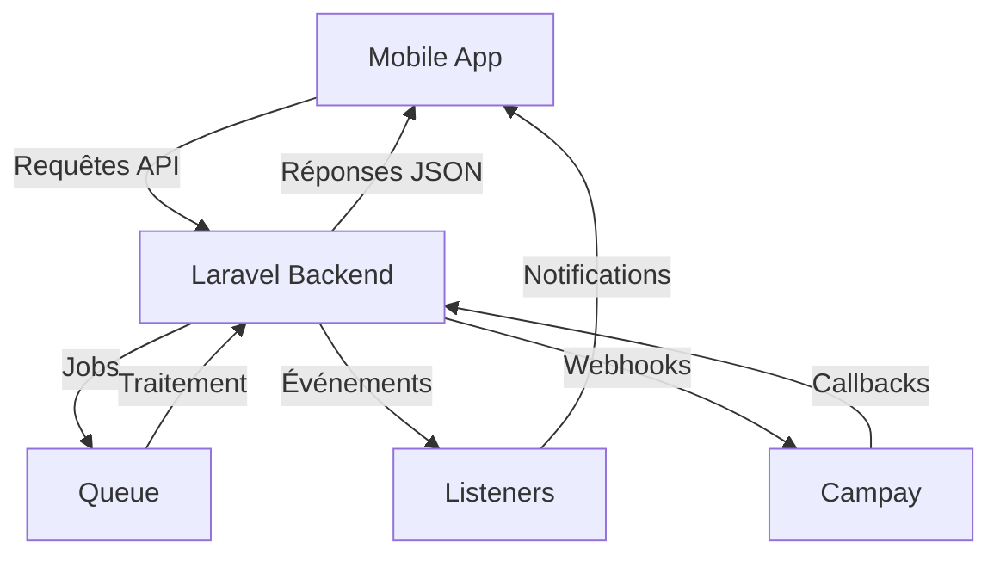

# SmallPay - Solution de Paiement Échelonné Mobile


**SmallPay** est une solution mobile innovante de paiement échelonné (« Buy Now, Pay Later ») conçue pour les marchés africains, avec une intégration complète de KYC (Know Your Customer) et des paiements mobiles via Campay.

## 🌍 Vision et Objectifs

SmallPay vise à révolutionner l'accès au crédit et aux achats en ligne en Afrique en offrant :

- **Inclusion financière** : Permettre aux utilisateurs sans carte de crédit d'accéder à des achats échelonnés
- **Expérience mobile-first** : Une application intuitive et optimisée pour les smartphones
- **Sécurité renforcée** : Processus KYC complet avec vérification d'identité et caution
- **Flexibilité de paiement** : Paiements via mobile money (Campay) et autres méthodes locales
- **Transparence** : Calcul clair des intérêts et échéanciers de paiement

## 🚀 Fonctionnalités Principales

### 📱 Application Mobile (React Native + Expo)

#### **Authentification et Sécurité**
- ✅ Inscription avec email/téléphone + vérification OTP
- ✅ Connexion sécurisée avec JWT
- ✅ Mot de passe oublié avec réinitialisation OTP
- ✅ Vérification de disponibilité email/téléphone
- ✅ Gestion de session et déconnexion

#### **Catalogue Produits**
- 🛍️ Liste des produits avec pagination
- 🔍 Recherche et filtrage avancé
- 🏷️ Catégories et produits en vedette
- 📸 Galeries d'images produits
- 💰 Affichage des prix et options de paiement échelonné

#### **Processus d'Achat**
- 🛒 Panier d'achat persistant
- 📝 Création de commandes
- 💳 Calcul automatique des échéanciers
- 📅 Visualisation des plans de paiement
- 📋 Résumé de commande avant validation

#### **Paiements Échelonnés**
- 💰 Paiement initial (dépôt)
- 📅 Paiements mensuels automatiques
- 🔄 Suivi des paiements effectués
- ⏰ Rappels de paiements à venir
- ⚠️ Notifications de retard

#### **KYC (Know Your Customer)**
- 📋 Formulaire KYC complet
- 📸 Téléchargement de documents d'identité
- 👤 Vérification du client et du garant
- 📝 Signature électronique de documents
- ⏳ Suivi du statut de vérification

#### **Profil Utilisateur**
- 👤 Informations personnelles
- 📱 Historique des commandes
- 💳 Historique des paiements
- 🔔 Préférences de notification
- 🔒 Paramètres de sécurité

#### **Notifications**
- 🔔 Notifications push en temps réel
- 📬 Centre de notifications
- ✅ Marquage comme lues
- 🔔 Rappels de paiement
- 📋 Mises à jour de statut de commande

### 🖥️ Backend (Laravel API)

#### **API RESTful Complète**
- 🔐 Authentification JWT avec Sanctum
- 📡 Endpoints sécurisés avec middleware
- 🎯 Routes organisées par modules
- 📊 Pagination et filtrage
- 🔄 Validation des données

#### **Gestion Utilisateurs**
- 👥 CRUD utilisateurs
- 🔐 Rôles et permissions (admin/user)
- 🚫 Blocage/déblocage de comptes
- 📊 Statistiques d'utilisation

#### **Gestion Produits**
- 📦 CRUD produits
- 🏷️ Catégories et tags
- 📸 Gestion des images
- 🔍 Recherche avancée
- 📊 Analytics produits

#### **Gestion Commandes**
- 📋 Création et suivi
- 📦 Statuts de commande
- 🔄 Mises à jour en temps réel
- 📊 Historique complet
- 💰 Calculs financiers

#### **Paiements Intégrés**
- 💳 Intégration Campay (Mobile Money)
- 🔄 Webhooks de paiement
- 📊 Suivi des transactions
- 🔒 Sécurité des transactions
- 📋 Historique des paiements

#### **KYC Backend**
- 📋 Soumission et stockage
- 👤 Vérification manuelle admin
- ✅ Approbation/rejet
- 📝 Historique des vérifications
- 📊 Statistiques KYC

#### **Notifications Backend**
- 🔔 Création et envoi
- 📬 Historique
- ✅ Statuts de lecture
- 📊 Analytics notifications

#### **Analytics Admin**
- 📈 Revenus par jour
- 📊 Ventes par catégorie
- 🏆 Produits populaires
- 👥 Meilleurs clients
- 📈 Inscriptions par jour
- 📦 Stock par catégorie

## 🎯 Acteurs du Système

### **1. Clients (Utilisateurs Finaux)**
- **Rôle** : Effectuer des achats avec paiement échelonné
- **Fonctionnalités** :
  - Parcourir le catalogue
  - Ajouter des produits au panier
  - Soumettre une demande KYC
  - Effectuer des paiements
  - Suivre leurs commandes et paiements

### **2. Administrateurs**
- **Rôle** : Gérer la plateforme et valider les KYC
- **Fonctionnalités** :
  - Gestion des utilisateurs (blocage/déblocage)
  - Validation des demandes KYC
  - Gestion du catalogue produits
  - Suivi des commandes
  - Accès aux analytics et rapports

### **3. Système Automatique**
- **Rôle** : Traiter les opérations en arrière-plan
- **Fonctionnalités** :
  - Envoi de notifications (rappels de paiement)
  - Mise à jour des statuts de commande
  - Génération d'échéanciers de paiement
  - Traitement des webhooks de paiement
  - Nettoyage des données expirées

## 📦 Modules Techniques

### **Frontend Mobile (React Native/Expo)**
```
smallpay_mobile_app/
├── app/                  # Écrans et navigation
│   ├── auth/             # Authentification (login, register, OTP)
│   ├── (tabs)/           # Navigation principale
│   ├── order/            # Gestion des commandes
│   ├── payment/          # Processus de paiement
│   ├── product/          # Catalogue produits
│   └── profile/          # Profil utilisateur
├── components/           # Composants réutilisables
├── context/              # Contexte (Theme, Auth)
├── hooks/                # Hooks personnalisés
├── lib/                  # Services API
├── store/                # Redux (gestion d'état)
└── utils/                # Fonctions utilitaires
```

### **Backend API (Laravel)**
```
SmallPay_backend/
├── app/
│   ├── Http/
│   │   ├── Controllers/   # Contrôleurs API
│   │   └── Middleware/   # Middleware d'authentification
│   ├── Models/           # Modèles Eloquent
│   ├── Services/         # Logique métier
│   ├── Jobs/             # Tâches en arrière-plan
│   └── Events/Listeners/ # Événements et écouteurs
├── routes/              # Définition des routes API
├── database/            # Migrations et seeders
└── config/               # Configuration
```

## 🛠️ Technologies Utilisées

### **Mobile Application**
- **Framework** : React Native avec Expo
- **Navigation** : Expo Router + React Navigation
- **State Management** : Redux Toolkit
- **UI** : Lucide React Native Icons
- **Storage** : AsyncStorage + SecureStore
- **API** : Axios
- **Forms** : Validation personnalisée
- **Notifications** : Expo Notifications
- **Images** : Expo Image Picker
- **Documents** : Expo Document Picker

### **Backend API**
- **Framework** : Laravel 12
- **Authentification** : Laravel Sanctum (JWT)
- **Base de données** : MySQL
- **ORM** : Eloquent
- **Validation** : Laravel Validator
- **Paiements** : Intégration Campay API
- **Filesystem** : Laravel Storage
- **Queue** : Laravel Queue
- **Testing** : Pest PHP
- **Code Quality** : Laravel Pint

### **Outils de Développement**
- **Version Control** : Git
- **Package Management** : Composer (PHP), npm (JS)
- **Linting** : ESLint (JS), PHP CS Fixer
- **Formatting** : Prettier, Laravel Pint
- **CI/CD** : GitHub Actions

## 🚀 Installation et Configuration

### Prérequis

#### Pour le Backend (Laravel)
- PHP 8.2+
- Composer
- MySQL 5.7+
- Node.js 18+
- npm/yarn

#### Pour le Mobile (React Native)
- Node.js 18+
- npm/yarn
- Expo CLI
- Android Studio (pour émulateur)
- Xcode (pour iOS, Mac uniquement)

### Installation Backend

```bash
# Cloner le dépôt
git clone https://github.com/votre-utilisateur/smallpay.git
cd smallpay/SmallPay_backend

# Installer les dépendances
composer install
npm install

# Configurer l'environnement
cp .env.example .env
php artisan key:generate

# Configurer la base de données dans .env
DB_CONNECTION=mysql
DB_HOST=127.0.0.1
DB_PORT=3306
DB_DATABASE=smallpay
DB_USERNAME=root
DB_PASSWORD=

# Migrer la base de données
php artisan migrate --seed

# Configurer Campay (dans .env)
CAMPAY_API_KEY=votre_cle_api_campay
CAMPAY_MERCHANT_ID=votre_merchant_id
CAMPAY_SECRET_KEY=votre_secret_key

# Démarrer le serveur de développement
php artisan serve

# Dans un autre terminal, démarrer la file d'attente
php artisan queue:listen

# Démarrer Vite pour les assets
npm run dev
```

### Installation Mobile

```bash
# Aller dans le dossier mobile
cd ../smallpay_mobile_app

# Installer les dépendances
npm install

# Configurer l'API backend
# Modifier le fichier lib/api.ts pour pointer vers votre backend
API_BASE_URL="http://votre-ip-local:8000/api"

# Démarrer l'application
npx expo start

# Pour Android
npx expo start --android

# Pour iOS
npx expo start --ios

# Pour build production
npx expo build:android
npx expo build:ios
```

## 📱 Configuration Mobile Money (Campay)

Pour activer les paiements via Mobile Money :

1. **Créer un compte Campay** sur [https://campay.net](https://campay.net)
2. **Obtenir vos clés API** dans le tableau de bord Campay
3. **Configurer les variables d'environnement** dans `.env` :

```env
CAMPAY_API_KEY=votre_cle_api
CAMPAY_MERCHANT_ID=votre_merchant_id
CAMPAY_SECRET_KEY=votre_secret_key
CAMPAY_ENVIRONMENT=sandbox  # ou 'production'
```

4. **Configurer les webhooks** dans votre tableau de bord Campay pour pointer vers :
   ```
   http://votre-domaine.com/api/payments/webhook
   ```

## 🔧 Commandes Utiles

### Backend Laravel

```bash
# Démarrer le serveur
hphp artisan serve

# Exécuter les migrations
php artisan migrate

# Exécuter les seeders
php artisan db:seed

# Lancer les tests
php artisan test

# Formater le code
./vendor/bin/pint

# Générer une clé d'application
php artisan key:generate

# Vider le cache
php artisan cache:clear
php artisan config:clear
php artisan view:clear

# Démarrer la file d'attente
php artisan queue:listen

# Démarrer le worker de queue (production)
php artisan queue:work --daemon
```

### Mobile React Native

```bash
# Démarrer l'application
npx expo start

# Démarrer avec Android
npx expo start --android

# Démarrer avec iOS
npx expo start --ios

# Build Android
eas build --platform android

# Build iOS
eas build --platform ios

# Lancer les tests
npx expo lint

# Réinitialiser le projet (nettoyage)
npm run reset-project
```

## 📊 Architecture Technique

### Flux de Données



### Processus d'Achat Typique

1. **Utilisateur** parcourt les produits → Ajoute au panier
2. **Système** calcule le montant total et les options de paiement
3. **Utilisateur** choisit « Paiement échelonné » → Soumet KYC
4. **Admin** valide le KYC manuellement
5. **Utilisateur** effectue le paiement initial (dépôt)
6. **Système** crée l'échéancier de paiement
7. **Utilisateur** reçoit le produit
8. **Système** envoie des rappels pour les paiements mensuels
9. **Utilisateur** effectue les paiements via Mobile Money
10. **Système** met à jour le statut de la commande

## 🎓 Processus KYC

1. **Soumission** : Utilisateur remplit le formulaire KYC avec :
   - Informations personnelles
   - Pièce d'identité (recto/verso)
   - Photo du client
   - Document signé
   - Informations du garant
   - Pièce d'identité du garant

2. **Vérification Admin** :
   - Vérification des documents
   - Appel de vérification si nécessaire
   - Approbation ou rejet avec raison

3. **Statuts KYC** :
   - `pending` : En attente de vérification
   - `approved` : Validé, paiement échelonné autorisé
   - `rejected` : Refusé avec raison
   - `expired` : Documents expirés

## 💰 Processus de Paiement

### Paiement Initial (Dépôt)
- Montant : 30% du total (configurable)
- Méthode : Mobile Money via Campay
- Statut : `deposit_paid`
- Déclenche : Création de l'échéancier

### Paiements Mensuels
- Calculés automatiquement selon la durée
- Incluent la majoration (intérêts)
- Rappels envoyés 3 jours avant l'échéance
- Statuts : `pending`, `paid`, `overdue`, `failed`

### Échéancier Type
```
Montant Total : 100 000 FCFA
Dépôt (30%) : 30 000 FCFA
Reste : 70 000 FCFA
Durée : 3 mois
Taux : 5%

Échéancier :
- Mois 1 : 25 000 FCFA
- Mois 2 : 25 000 FCFA  
- Mois 3 : 25 000 FCFA
Total intérêts : 5 000 FCFA
```

## 🔒 Sécurité

### Backend
- **Authentification** : JWT avec Laravel Sanctum
- **Validation** : Validation des requêtes entrantes
- **Middleware** : Protection des routes sensibles
- **Rate Limiting** : Protection contre les attaques brute-force
- **CSRF** : Protection pour les formulaires web
- **CORS** : Configuration stricte des origines autorisées

### Mobile
- **Storage** : Chiffrement des données sensibles (SecureStore)
- **API** : Toutes les requêtes nécessitent un token valide
- **OTP** : Codes à usage unique pour les opérations sensibles
- **Permissions** : Demande explicite des permissions nécessaires
- **SSL Pinning** : Recommandé pour la production

### Données
- **Chiffrement** : Données sensibles chiffrées en base
- **Backup** : Sauvegardes régulières recommandées
- **RGPD** : Conformité avec les réglementations locales

## 📈 Métriques et Analytics

Le système fournit des dashboards complets pour :

- **Ventes** : Revenus par jour/semaine/mois
- **Produits** : Top produits, stock, rotations
- **Utilisateurs** : Nouveaux utilisateurs, activité
- **KYC** : Taux d'approbation, temps de traitement
- **Paiements** : Taux de réussite, retards
- **Notifications** : Taux d'ouverture, engagement

## 🌐 Intégrations Externes

### Campay API
- **Paiements Mobile Money** : MTN, Orange Money, Moov
- **Webhooks** : Notifications de paiement en temps réel
- **Callbacks** : Confirmation des transactions
- **Sandbox** : Environnement de test disponible

### Services de Notification
- **Email** : SMTP configurable
- **SMS** : Intégration avec des fournisseurs locaux
- **Push** : Notifications mobiles via Expo

## 📱 Captures d'Écran

*(À ajouter - captures des principaux écrans de l'application)*

## 🎯 Roadmap

### Version 1.0 (Actuelle)
- ✅ Authentification complète
- ✅ Catalogue produits
- ✅ Panier et commandes
- ✅ Processus KYC
- ✅ Intégration Campay
- ✅ Paiements échelonnés
- ✅ Notifications
- ✅ Tableau de bord admin

### Version 1.1 (Planifiée)
- 📱 Amélioration UX/UI
- 🌍 Support multilingue
- 💳 Ajout d'autres méthodes de paiement
- 📊 Analytics avancés
- 🔄 Synchronisation hors ligne
- 📋 Historique de crédit
- 👥 Programme de parrainage

### Version 2.0 (Future)
- 🤖 Chatbot d'assistance
- 📍 Géolocalisation des points de retrait
- 💰 Score de crédit interne
- 📈 Offres personnalisées
- 🔄 Intégration avec d'autres plateformes e-commerce
- 🌍 Expansion à d'autres pays africains

## 🤝 Contribution

Les contributions sont les bienvenues ! Voici comment contribuer :

1. **Forker** le projet
2. **Créer une branche** pour votre fonctionnalité (`git checkout -b feature/ma-fonctionnalité`)
3. **Commiter** vos changements (`git commit -m 'Ajout de ma fonctionnalité'`)
4. **Pusher** la branche (`git push origin feature/ma-fonctionnalité`)
5. **Ouvrir une Pull Request**

### Conventions de Code

#### Backend (PHP/Laravel)
- **PSR-12** : Standard de codage
- **Noms de classes** : PascalCase
- **Noms de méthodes** : camelCase
- **Noms de variables** : snake_case pour les bases de données, camelCase pour le code
- **Documentation** : PHPDoc pour toutes les méthodes publiques

#### Frontend (React Native/TypeScript)
- **Noms de composants** : PascalCase
- **Noms de variables** : camelCase
- **Noms de fonctions** : camelCase
- **Props** : Typage TypeScript obligatoire
- **Hooks** : Préfixe `use` pour les hooks personnalisés

## 📝 Licence

Ce projet est sous licence **MIT** - voir le fichier [LICENSE](LICENSE) pour plus de détails.

## 📞 Support

Pour toute question ou problème :

- **Documentation** : Consulter les fichiers dans le dossier `/docs`
- **Issues** : Ouvrir une issue sur GitHub
- **Email** : support@smallpay.com *(à configurer)*
- **Communauté** : Rejoindre notre serveur Discord *(à créer)*

## 🎉 Remerciements

- **Expo** pour le framework React Native
- **Laravel** pour le backend élégant
- **Campay** pour l'intégration Mobile Money
- **Tous les contributeurs** qui ont participé à ce projet

---

© 2026 SmallPay. Tous droits réservés.

*SmallPay - Achetez maintenant, payez plus tard, en toute confiance.*
